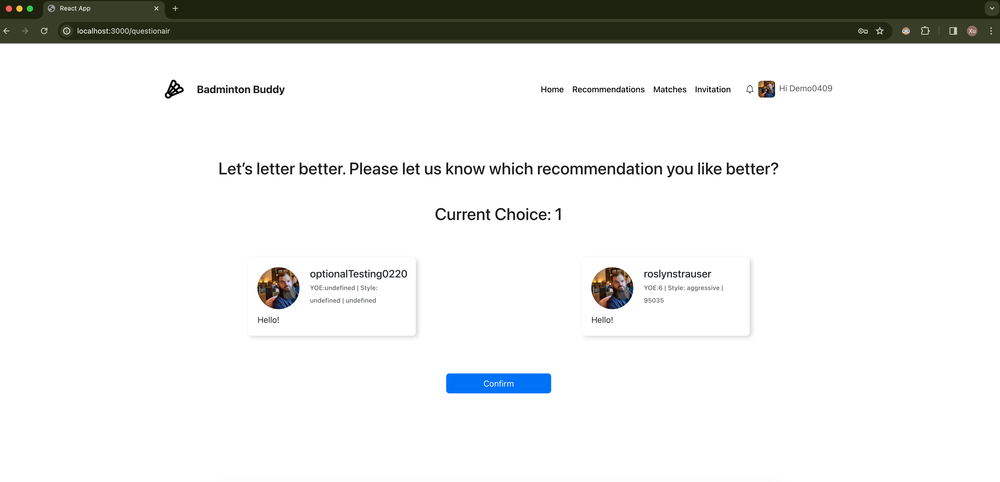
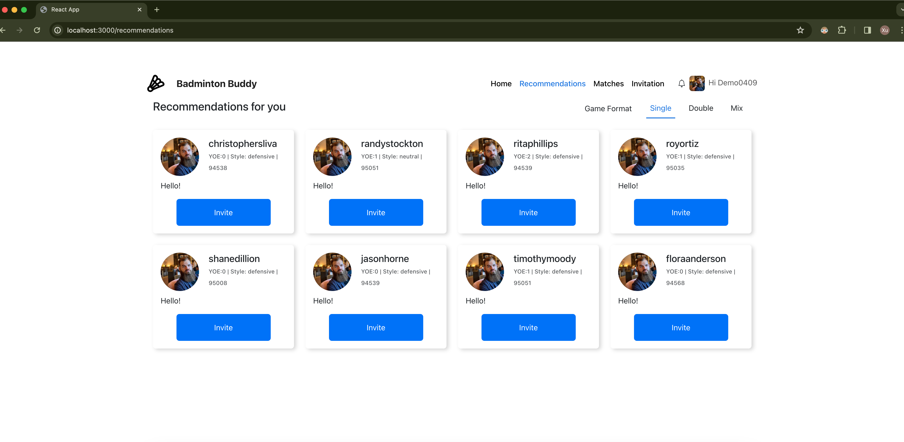
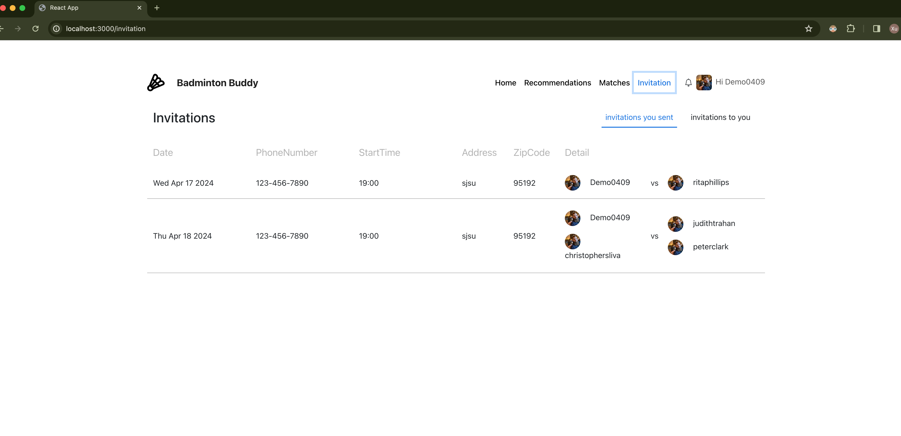

# Badminton Buddy Instruction

#### 1. Environment Setup

In the frontend folder, type this command in terminal to install the dependencies for the project.

```
npm install
```

Then use this command to start the project.

```
npm start
```

#### 2. Signup/Login

http://localhost:3000/signup
This is the page for user signup. Users need to type their name, zipcode, years of experience, email addrress, and password to signup.


http://localhost:3000/login
This is the page for user login. Users can use their email and password to login.


#### 3. User Profile Initialization

http://localhost:3000/firstvisit
After signup, users will be redirected to this page. Users can set their profiles, gender, age, zipcode, years of experience, acceptable matching distance, user stories for further use. They can set their play style from choices aggressive, neutral, defensive. And they can choose their play format choices form single, double, mix.


#### 4. User AI Model

http://localhost:3000/questionair
After profile setup, users will be redirected to this page. They need to select 10 players who they want to play with from 20 choices. This is for AI training model that helps recommend players users would like to play with.




#### 5. Home Page

http://localhost:3000/home
This is the home page. Users can get their rating scores in this page. Also they can browse their recent games under the rating score.


#### 6. Recommendation Page

http://localhost:3000/recommendations
Users can find players from system recommendation. They can choose the play format from 3 buttons, Single, Double, Mix on the top right.

##### Single Recommendation

There are 8 player choices for users to make selections.


After clicking the Invite button in the player card, users can fill up a single game invitation to the selected player.


##### Double Recommendation

After clicking Double button on the top right, a prompt box pops up. If users know the player who they want to play with as partner, they can just type the parnter's email in the box to the next step. Or they can click the next line to find a partner from system recommendation.


If users want to choose partner from system recommendation, this page can provide 8 choices for users.


After the partner chosen, users can choose two opponents to play with. System can provide 8 players for opponent I and II.


After partner and opponents chosen, users can fill up a double game invitation to the selected player.


##### Mix Recommendation

This part is same as double recommendation.

#### 7. Match Page

http://localhost:3000/matches
This is the match page. Users can add match and browse their recent matches.


By click the Add Match buton on the top, user can add match result to database.

This is the form to add single match result.


This is the form to add double/mix match result.


#### 8. Invitation Page

http://localhost:3000/invitation
Users can browse their invitaions in the invitation page.
The contact phone number and game start time are shown in this page.
By clicking the invitations you sent on the top right, users can browse the invitations they sent.


By clicking the invitations to you on the top right, users can browse the invitations from other players.


#### 9. Profile Editing Page

http://localhost:3000/profile
By clicking the User Avatar or Username on the top right. User can go to the profile editing page to edit their profile.


